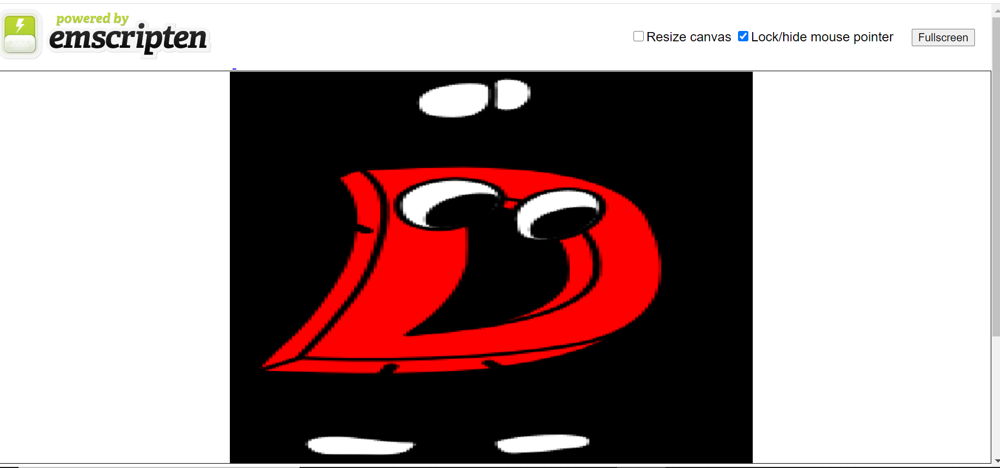

# D + betterC + SDL + WASM

Reproduction of the example on https://theartofmachinery.com/2018/12/20/emscripten_d.html

- My [bindbc-sdl](https://github.com/aferust/bindbc-sdl) fork must be used since core.stdc does not work with WebAssembly yet.
- Compile
`dub build --compiler=ldc2 --build=release --build-mode=allAtOnce --combined --arch=wasm32-unknown-unknown-wasm -v`

- move generated *.bc file from .dub/obj/app.bc.bc to the root of the project, end rename it to app.bc.
- Use your Emscripten sdk to generate wasm: `emcc -v -O0 -s WASM=1 -s USE_SDL=2 -s USE_SDL_IMAGE=2 -s SDL2_IMAGE_FORMATS=[\"png\"] -s ENVIRONMENT=web --embed-file images -o dist/index.html app.bc`
- Start an html server using such as python 
```
cd dist
python -m http.server
```

## Demo
